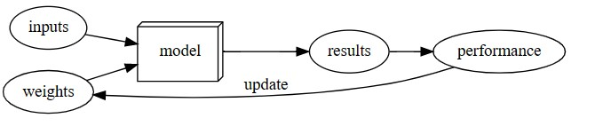

# **What is Deep Learning?**
<!----------------------------------------------------------- 
                    Quote from Textbook 
------------------------------------------------------------>
### **Definition**
A fantastic quote by Arthur Samuel, summarises Deep Learning (DL) as:

 

>  "Some automatic means of testing the effectiveness of any current  weight assignment  in terms of  actual performance  and provide a  mechanism  for altering the weight assignment so as to maximize the performance"
[by Arthur Samuel in Fastai Book, Chapter 1](https://nbviewer.org/github/fastai/fastbook/blob/master/01_intro.ipynb)

<!----------------------------------------------------------- 
                    DL Components 
------------------------------------------------------------>

### **Core Processes of Deep Learning:**

Decomposing the above statement, we can better understand the three core processes that underpin DL operation:

<!--- Table Explaining Concepts--->
| Term | Meaning |
| :---         |     :---      |
 Weight Assignment  | Parameters (weights) that process inputs to yield output(s)
 Mechanism    | Automatically adjust the weight assignments to optimise performance. 
 Actual Performance | The overall quality of the output. That is, the degree by which the test loss.   

### **DL Functionality**
To develop a mechanism that can measure performance of a model, the DL architecture must be capable of:
* **Comparing** a winning and losing model 
* From this, **determine** a winning direction
* So it can, **learn** from each iteration, improving with experience

Thus, the DL model can be visually described as shown below: 

<!---(Photo of myself) -->

[Image Source: Fastai Book, Chapter 1](https://nbviewer.org/github/fastai/fastbook/blob/master/01_intro.ipynb)

# Reference List
    https://nbviewer.org/github/fastai/fastbook/blob/master/01_intro.ipynb

    
