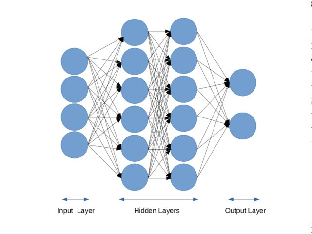

# Foundation of Neural Networks
## What is a Neural Network?
As discussed by [IBM](https://www.ibm.com/topics/neural-networks), neural networks are a fundamental component of deep learning models.
They consists of **node layers**. Each node is designated a certain weight and threshold. 
As shown below, the **input** layers are related to the **output** layers via multiple hidden layers:

From paper ["Using Deep Learning to Localize Gravitational Wave Sources"](https://www.researchgate.net/publication/335855384_Using_Deep_Learning_to_Localize_Gravitational_Wave_Sources/figures?lo=1)

$$ a $$

